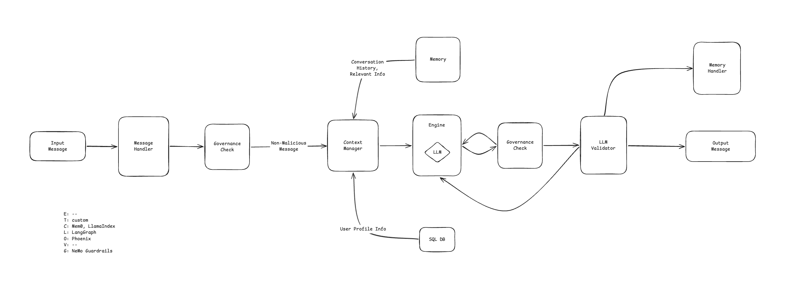

# Vision

Build an agentic AI platform that provides a modular foundation for orchestrating execution environments, tooling, context, lifecycle and orchestration, observability, verification, and governance (ETCLOVG).

The initial minimum viable product (MVP) focuses on personalized communication, enabling the agent to continuously adapt its communication style and interactions based on the user.

The platform shall be modular and extensible, allowing new capabilities to be added with minimal architectural impact.

---

# Business Requirements

## User Capabilities

- Users can begin new conversations with the agent.
- Users can continue previous conversations.
- Users can create temporary (Incognito) conversations.
- Users can view and manage conversation history.
- Users can configure agent preferences.

## User Experience

- Conversations should feel natural and coherent.
- The agent should adapt its communication style over time based on the user.
- The agent should maintain conversational context throughout an interaction.
- Responses should be relevant, helpful, and consistent.

---

# Functional Requirements

## Conversation Management

- The system shall create, retrieve, update, and delete conversations.
- The system shall retrieve conversations using a unique identifier.
- The system shall support temporary (Incognito) conversations.
- Temporary conversations shall not persist conversation history.
- Temporary conversations shall not create or modify long-term agent memory.

## Context Management

- The system shall maintain conversational context throughout an active session.
- The system shall assemble runtime context prior to response generation.
- The system shall include relevant conversation history when generating responses.
- The system shall support configurable agent instructions.

## Personalization

- The system shall maintain persistent personalization data for each user.
- The system shall retrieve applicable personalization data during response generation.
- The system shall allow personalization data to be created, updated, and deleted.

---

# Non-Functional Requirements

## Extensibility

- The platform shall support the addition of new capabilities with minimal modification to existing components.
- Major platform capabilities shall communicate through well-defined interfaces.

## Maintainability

- Business logic shall remain independent of infrastructure implementations.
- Components shall have clearly defined responsibilities and boundaries.

## Scalability

- The platform shall support multiple users.
- The platform shall support interchangeable implementations for major subsystems (for example, inference engines, memory providers, and tool providers).

## Observability

- System events shall be logged.
- Errors shall be captured with sufficient diagnostic information for troubleshooting.
- LLM and user activity shall be logged to enforce non-repudiation.

## Reliability

- Conversation history and persistent personalization data shall survive application restarts.
- The system shall recover gracefully from recoverable failures whenever possible.

---

# Software Architecture

m0-akDXRa9XaV4dqjYKIkPFPCEme0TSpUP4vlNiv3RZ
