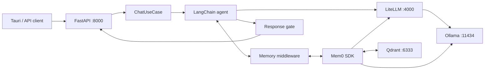

# Harness Backend

FastAPI backend for Maia, with LangChain/LangGraph orchestration, LiteLLM model
routing, and Mem0/Qdrant durable memory.

## Quick start

The normal development path is `npm run tauri dev` from the frontend. It starts
the Docker stack and this API automatically.

To run the backend directly:

```powershell
python -m venv .venv
.\.venv\Scripts\Activate.ps1
pip install -r requirements.txt
python main.py
```

| Service | Default URL |
| --- | --- |
| Harness API | `http://127.0.0.1:8000` |
| OpenAPI UI | `http://127.0.0.1:8000/docs` |
| LiteLLM | `http://127.0.0.1:4000` |
| Ollama | `http://127.0.0.1:11434` |
| Qdrant | `http://127.0.0.1:6333` |

## System map



Mem0 runs inside the backend process. LiteLLM, Ollama, and Qdrant run as
separate Compose services.

## Architecture

Dependencies point inward:

```text
presentation → application → domain
infrastructure → application → domain
```

| Layer | Path | Responsibility |
| --- | --- | --- |
| Domain | `domain/` | Core entities and provider-independent rules |
| Application | `application/` | Use cases, ports, and shared schemas |
| Infrastructure | `infrastructure/` | LangChain, LiteLLM, Mem0, and provider adapters |
| Presentation | `presentation/`, `main.py` | FastAPI routes and dependency wiring |

### Chat lifecycle

| Step | Component | Action |
| ---: | --- | --- |
| 1 | FastAPI | Validates the request and creates a `ChatCommand` |
| 2 | `ChatUseCase` | Calls the provider-neutral `AgentPort` |
| 3 | Memory middleware | Injects relevant Mem0 memories |
| 4 | LangChain agent | Calls the selected model through LiteLLM |
| 5 | Response gate | Allows, repairs, or replaces the final draft |
| 6 | Memory middleware | Submits the completed turn to Mem0 |
| 7 | FastAPI | Returns content, session ID, usage, and finish reason |

## API

| Method | Path | Purpose |
| --- | --- | --- |
| `GET` | `/api/health` | Returns `{ "status": "ok" }` |
| `POST` | `/api/chat` | Runs one conversational turn |

### `POST /api/chat`

| Field | Type | Required | Default |
| --- | --- | :---: | --- |
| `message` | string | Yes | — |
| `model` | string | Yes | — |
| `user_id` | string | Yes | — |
| `session_id` | string | No | New UUID |
| `temperature` | number | No | `0.7` |
| `max_tokens` | integer/null | No | `1024` |

The response contains `content`, `session_id`, `usage`, and `finish_reason`.
Reuse `session_id` to continue a conversation. Production callers should derive
`user_id` from authentication rather than trusting the request body.

## Configuration

### Agent and API

| Variable | Default | Purpose |
| --- | --- | --- |
| `LITELLM_BASE_URL` | Required | LiteLLM endpoint |
| `LITELLM_API_KEY` | `EMPTY` | LiteLLM credential |
| `LITELLM_TIMEOUT` | `60` | Model request timeout in seconds |
| `LITELLM_MAX_RETRIES` | `2` | Provider retry count |
| `CORS_ALLOW_ORIGINS` | Empty | Comma-separated allowed browser origins |
| `AGENT_SUMMARY_TRIGGER_TOKENS` | `5000` | Conversation summarization watermark |
| `AGENT_SUMMARY_KEEP_MESSAGES` | `8` | Recent messages retained after summarization |
| `AGENT_RESPONSE_GATE` | `true` | Enable final-response evaluation |
| `AGENT_RESPONSE_GATE_MAX_REPAIRS` | `1` | Maximum response repair attempts |

### Memory

| Variable | Default | Purpose |
| --- | --- | --- |
| `MEM0_QDRANT_URL` | — | Qdrant URL; preferred over host/port |
| `MEM0_COLLECTION_NAME` | `harness_memories` | Vector collection |
| `MEM0_LLM_MODEL` | `qwen` | Memory extraction model through LiteLLM |
| `MEM0_EMBEDDER_MODEL` | `nomic-embed-text` | Ollama embedding model |
| `MEM0_EMBEDDING_DIMS` | `768` | Embedding dimensions |
| `MEM0_HISTORY_DB_PATH` | `$MEM0_DIR/history.db` | Local Mem0 history database |

## Local logs

| File | Setting | Contents |
| --- | --- | --- |
| `.logs/agent-context.jsonl` | `AGENT_CONTEXT_LOGGING` | Effective model input and token usage |
| `.logs/response-gate.jsonl` | `AGENT_RESPONSE_GATE_LOGGING` | Gate verdicts, repairs, errors, and evaluator usage |

| Mode | Content |
| --- | --- |
| `off` | No file output |
| `structure` | Message structure, sizes, decisions, and usage |
| `full` | Structure plus model-visible content and gate feedback |

Gate logging inherits `AGENT_CONTEXT_LOGGING` and `AGENT_CONTEXT_LOG_DIR`
unless `AGENT_RESPONSE_GATE_LOGGING` or `AGENT_RESPONSE_GATE_LOG_DIR` is set.
Tauri development enables full logging and mounts `.logs/` into the backend
container.

> Full logs may contain conversations and retrieved memories. Keep them off
> outside local development.

## Tests

```powershell
python -m unittest discover -s tests
```
