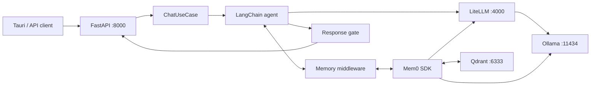

# Harness Backend

FastAPI backend for Maia, with LangChain/LangGraph orchestration, LiteLLM model
routing, and Mem0/Qdrant durable memory.

## Quick start

The normal development path is `npm run tauri dev` from the frontend. It starts
the Docker stack and this API automatically.

To run the backend directly:

```powershell
python -m venv .venv
.\.venv\Scripts\Activate.ps1
python -m pip install -r requirements-windows.txt
python main.py
```

| Dependency file | Platform | Use |
| --- | --- | --- |
| `requirements-windows.txt` | Windows | Local development |
| `requirements.txt` | Linux | Docker images and Linux development |
| `requirements.in` | Any | Source pins used to regenerate both lock files |

Hashed lock files are platform-specific. Do not use the Linux lock on Windows;
conditional dependencies such as `uvloop`, `colorama`, and `pywin32` will not
resolve correctly.

| Service | Default URL |
| --- | --- |
| Harness API | `http://127.0.0.1:8000` |
| OpenAPI UI | `http://127.0.0.1:8000/docs` |
| LiteLLM | `http://127.0.0.1:4000` |
| Ollama | `http://127.0.0.1:11434` |
| Qdrant | `http://127.0.0.1:6333` |

## System map



Mem0 runs inside the backend process. LiteLLM, Ollama, and Qdrant run as
separate Compose services.

## Architecture

Dependencies point inward:

```text
presentation → application → domain
infrastructure → application → domain
```

| Layer | Path | Responsibility |
| --- | --- | --- |
| Domain | `domain/` | Core entities and provider-independent rules |
| Application | `application/` | Use cases, ports, and shared schemas |
| Infrastructure | `infrastructure/` | LangChain, LiteLLM, Mem0, and provider adapters |
| Presentation | `presentation/`, `main.py` | FastAPI routes and dependency wiring |

### Module layout

Every package under `application/`, `infrastructure/`, and `presentation/` is
laid out the same way, so a module can be read without opening it first:

| File | Holds |
| --- | --- |
| `schemas.py` | Data contracts only. Frozen `slots=True` dataclasses at application ports; pydantic models at the tool, config, log, and HTTP edges |
| `<name>_port.py` | The `Protocol` only |
| `errors.py` | Errors raised across that boundary |
| `__init__.py` | The package's public surface: docstring, imports from its own submodules, `__all__` |

`presentation/api/` follows it too: `routes.py` holds the routes, `schemas.py`
holds the request and response bodies, and `__init__.py` exports the `router`
alone, because that is all the composition root asks of the package.

Schemas stay out of the port file because a port is a behavior contract and a
schema is a data contract; callers routinely need one without the other.

Imports follow from that split:

- **Across packages, import the package root** — `from application.conversation import ConversationPort`. Moving a file inside a package then costs nothing outside it.
- **Inside a package, import the module** — `conversation_port.py` uses `from application.conversation.schemas import ...`. Going through `__init__.py` from within the package it defines is how import cycles start.
- **A package exports only what it owns.** Domain entities come from `domain.entities`, never re-exported by an application package.

### Chat lifecycle

| Step | Component | Action |
| ---: | --- | --- |
| 1 | FastAPI | Validates the request and creates a `ChatCommand` |
| 2 | `ChatUseCase` | Calls the provider-neutral `AgentPort` |
| 3 | Memory middleware | Injects relevant Mem0 memories |
| 4 | LangChain agent | Calls the selected model through LiteLLM |
| 5 | Response gate | Allows, repairs, or replaces the final draft |
| 6 | Memory middleware | Submits the completed turn to Mem0 |
| 7 | FastAPI | Returns content, session ID, usage, and finish reason |

## API

| Method | Path | Purpose |
| --- | --- | --- |
| `GET` | `/api/health` | Returns `{ "status": "ok" }` |
| `POST` | `/api/chat` | Runs one conversational turn |

### `POST /api/chat`

| Field | Type | Required | Default |
| --- | --- | :---: | --- |
| `message` | string | Yes | — |
| `model` | string | Yes | — |
| `user_id` | string | Yes | — |
| `session_id` | string | No | New UUID |
| `temperature` | number | No | `0.7` |
| `max_tokens` | integer/null | No | `1024` |

The response contains `content`, `session_id`, `usage`, and `finish_reason`.
Reuse `session_id` to continue a conversation. Production callers should derive
`user_id` from authentication rather than trusting the request body.

## Configuration

Behavioral settings are version controlled in
`infrastructure/config.yaml`. The application validates the entire file at
startup, merges deployment environment values once, and produces one
`InfrastructureSettings` object. Each adapter consumes its relevant typed
section; leaf modules do not read YAML or environment variables.

```text
InfrastructureSettings
├── api       → FastAPI and CORS
├── gateway   → LiteLLM clients
├── agent     → LangChain and response gate
├── logging   → context and gate logs
├── langsearch → bounded live web search
└── mem0      → Mem0, Ollama embedder, and Qdrant
```

Configuration-aware infrastructure exposes `from_config()`. Composition code
uses that factory, while constructors stay explicit for dependency injection
and isolated tests:

```python
settings = load_infrastructure_settings()
memory = Mem0Adapter.from_config(settings.mem0)
agent = LangChainAdapter.from_config(settings, memory=memory)
```

Only `load_infrastructure_settings()` reads YAML or environment variables.

| YAML section | Controls |
| --- | --- | --- |
| `gateway` | Timeout and retry policy |
| `agent` | System prompt, summarization, memory retrieval, and response gate |
| `logging` | Default context and response-gate log modes |
| `langsearch` | Search endpoint, timeout, result count, freshness, and context budget |
| `mem0` | Extraction model, embedding dimensions, collection, and prompts |

Environment variables are reserved for values that differ by deployment:

| Variable | Default | Purpose |
| --- | --- | --- |
| `LITELLM_BASE_URL` | Required | LiteLLM service address |
| `LITELLM_API_KEY` | `EMPTY` | LiteLLM credential |
| `LANGSEARCH_API_KEY` | — | Enables the optional `search_web` agent tool |
| `OLLAMA_BASE_URL` | — | Ollama service address used by Mem0 |
| `MEM0_QDRANT_URL` | Local storage | Qdrant service address |
| `MEM0_QDRANT_API_KEY` | — | Optional Qdrant credential |
| `MEM0_EMBEDDER_MODEL` | YAML value | Deployment model pulled by Ollama |
| `MEM0_DIR` | `/tmp/mem0` | Writable Mem0 data directory |
| `CORS_ALLOW_ORIGINS` | Empty | Comma-separated browser/Tauri origins |
| `HARNESS_CONFIG_PATH` | Checked-in YAML | Optional alternate configuration file |

## Local logs

| File | Setting | Contents |
| --- | --- | --- |
| `.logs/agent-context.jsonl` | `AGENT_CONTEXT_LOGGING` | Effective model input and token usage |
| `.logs/response-gate.jsonl` | `AGENT_RESPONSE_GATE_LOGGING` | Gate verdicts, repairs, errors, and evaluator usage |

| Mode | Content |
| --- | --- |
| `off` | No file output |
| `structure` | Message structure, sizes, decisions, and usage |
| `full` | Structure plus model-visible content and gate feedback |

The YAML supplies log defaults. `AGENT_CONTEXT_LOGGING` and
`AGENT_CONTEXT_LOG_DIR` can override them per deployment. Gate logging inherits
those values unless `AGENT_RESPONSE_GATE_LOGGING` or
`AGENT_RESPONSE_GATE_LOG_DIR` is set.
Tauri development mounts `.logs/` into the backend container. Logging remains
controlled by `AGENT_CONTEXT_LOGGING` in the deployment `.env`.

> Full logs may contain conversations and retrieved memories. Keep them off
> outside local development.

## Tests

```powershell
python -m unittest discover -s tests
```
