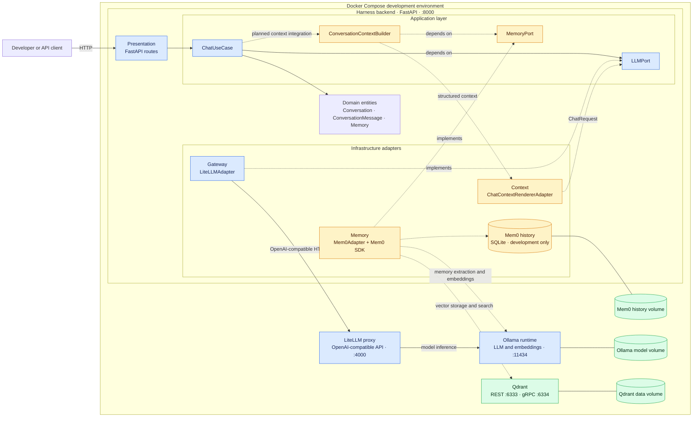

# Harness

Harness is a FastAPI backend for an AI assistant. It keeps the application core separate from concrete providers such as LiteLLM, Ollama, Mem0, and Qdrant.

## Run Locally

```bash
python -m venv .venv
source .venv/bin/activate
pip install -r requirements.txt
python main.py
```

The API starts on `http://127.0.0.1:8000`.

## API

- `GET /api/health`
- `POST /api/chat`

## Architecture

Harness follows a ports-and-adapters structure:

```text
presentation -> application -> domain
infrastructure -> application -> domain
```

Dependencies should point inward. The core application should not depend on FastAPI, LiteLLM, Ollama, Mem0, Qdrant, databases, or other provider details.

### Enterprise Development Architecture

The development environment uses Docker Compose to keep model infrastructure and
stateful services reproducible while the backend preserves ports-and-adapters
boundaries. Mem0 runs as an SDK inside the backend rather than as a separate
service.



Solid arrows show the currently composed chat path. Dashed arrows show the
memory and context path whose adapters exist but are not yet injected into
`ChatUseCase`. Qdrant has no upstream service dependency; its named volume
provides durable vector data, while the backend's Mem0 volume preserves its
local history database. The backend reaches Compose services by their service
names, such as `http://litellm:4000`,
`http://ollama:11434`, and `http://qdrant:6333`.

### Layer Overview

| Layer          | Path                              | Purpose                                                         |
| -------------- | --------------------------------- | --------------------------------------------------------------- |
| Domain         | `domain/`                       | Defines core entities and business rules.                       |
| Application    | `application/`                  | Defines use cases, ports, and provider-neutral schemas.         |
| Infrastructure | `infrastructure/`               | Implements application ports with concrete tools and services.  |
| Presentation   | `presentation/` and `main.py` | Exposes the application through FastAPI and wires dependencies. |

### Domain

| Area                 | Purpose                                                                                         |
| -------------------- | ----------------------------------------------------------------------------------------------- |
| `domain/entities/` | Core entities such as`Conversation`, `ConversationMessage`, and `Memory`.                 |
| Business rules       | Validation and behavior that should be true regardless of storage, API, or model provider.      |
| Dependency rule      | Should not import application, infrastructure, FastAPI, Mem0, Qdrant, LiteLLM, Ollama, or vLLM. |

### Application

| Area                            | Purpose                                                                           |
| ------------------------------- | --------------------------------------------------------------------------------- |
| `application/use_cases/`      | Orchestrates workflows such as chat.                                              |
| `application/llm/`            | Defines the provider-neutral LLM port and chat schemas.                           |
| `application/conversation/`   | Defines the conversation persistence port.                                        |
| `application/memory/`         | Defines the durable memory port and schemas.                                      |
| `application/context/`        | Defines context building and rendering contracts.                                 |
| `application/memory_handler/` | Defines how completed turns become memory candidates.                             |
| Dependency rule                 | May depend on domain, but should not depend on concrete infrastructure providers. |

### Infrastructure

| Area                                    | Purpose                                                                                     |
| --------------------------------------- | ------------------------------------------------------------------------------------------- |
| `infrastructure/gateway/`             | Gateway adapters such as the OpenAI-compatible LiteLLM adapter.                             |
| `infrastructure/llm/`                 | Direct model-runtime adapters such as Ollama and vLLM.                                      |
| `infrastructure/memory/Mem0_adapter/` | Memory adapter and Mem0 configuration.                                                      |
| `infrastructure/context/`             | Concrete context builder implementations.                                                   |
| `infrastructure/memory_handler/`      | Concrete memory handling implementations.                                                   |
| Dependency rule                         | Implements application ports and translates provider-specific APIs into application models. |

### Presentation

| Area                           | Purpose                                                                                                   |
| ------------------------------ | --------------------------------------------------------------------------------------------------------- |
| `presentation/api/routes.py` | FastAPI route definitions and request/response mapping.                                                   |
| `presentation/api/schemas/`  | API-facing schemas, when route schemas are split out.                                                     |
| `main.py`                    | FastAPI app creation and dependency wiring.                                                               |
| Dependency rule                | Calls application use cases; should not contain domain logic or provider-specific implementation details. |

## Current Chat Flow

```text
FastAPI route
  -> ChatUseCase
  -> LLMPort
  -> LLM adapter
```
